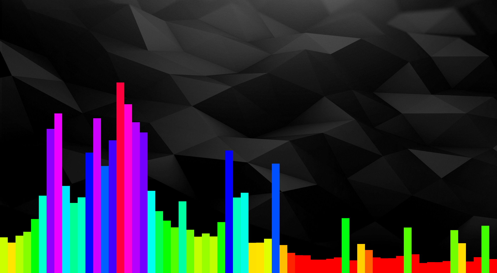

# Dance

Dance is the working name for a high performance music visualizer powered by the Windows multimedia API, FFTW3, and DirectX.
The goal of this project is twofold: to provide exciting visuals and customization for end users while also serving as a reference for the APIs it relies on.
In addition to maintaining a consistent code format and idiomatic style, our goal is to document pretty much every line of code.

## Design

The overall structure of the application is fairly simple.
Upon initialization, we create a DirectX 2D device and setup a composition pipeline for the transparent window background.
We also set up DXGI so we can render both 3D and 2D to the window's surface. 
Finally, we instantiate an audio capture client to listen to the default audio output.
During runtime, incoming audio data is read, transformed via FFTW3 real FFT, and provided to a visualizer plugin that has access to the window's rendering pipeline.
